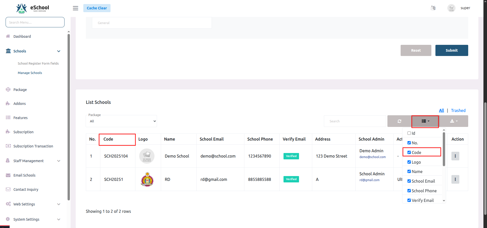
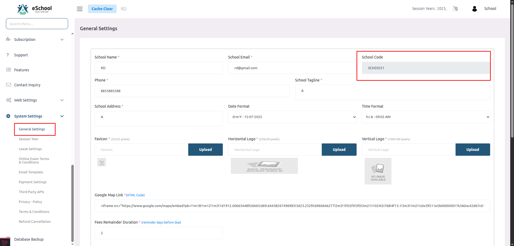
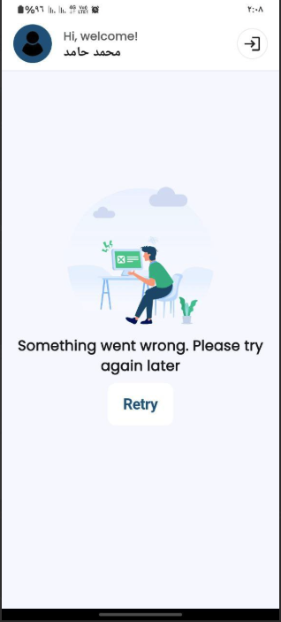
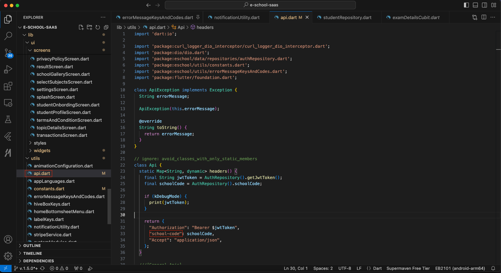

# ❓ FAQs

This section addresses common questions and issues you might encounter during the installation and setup process of eSchool SaaS.

## 🚨 Installation & Setup Issues

<details>
<summary><strong>1. Why is the school not being created and showing an "Error Occurred" message?</strong></summary>

This error typically occurs when the database user does not have permission to create or drop databases, which is required for setting up a new school.

**Root Cause:** By default, hosting providers do not assign these permissions to normal database users for security reasons.

**Solution:**
- You must assign the necessary permissions (such as CREATE, DROP, and ALTER) to your database user or use database root user credential.

**Need Help?** If you are unsure how to proceed, contact your control panel or server support provider and ask them:
> "How can I assign CREATE and DROP database permissions to my database user?"

</details>

## 🌐 Domain & SSL Configuration

<details>
<summary><strong>2. How do I set up a wildcard domain (e.g., *.yourdomain.com)?</strong></summary>

Setting up a wildcard domain involves creating a DNS record and configuring it properly in your hosting panel.

**Note:** Since the steps can vary depending on the hosting provider or control panel (e.g., cPanel, Plesk), we recommend contacting your hosting support team for detailed guidance on setting up wildcard DNS records.

**Common Steps:**
1. Access your domain's DNS management panel
2. Create a new DNS record with type `A` or `CNAME`
3. Set the hostname to `*` (wildcard)
4. Point it to your server's IP address or domain

</details>

<details>
<summary><strong>3. How do I create a wildcard SSL certificate?</strong></summary>

Wildcard SSL setup depends on your hosting provider and the type of SSL certificate you need.

**Recommended Action:** Please reach out to your control panel or hosting support to request and install a wildcard SSL certificate for your domain (e.g., *.yourdomain.com).

**Common Options:**
- Let's Encrypt (free, with limitations)
- Commercial SSL providers (paid, more features)
- Hosting provider's SSL services

</details>

## 💳 Subscription & Package Management

<details>
<summary><strong>4. What happens if the Super Admin updates an existing subscription package?</strong></summary>

The behavior depends on the "Instant Effect" setting when updating the package:

**✅ Instant Effect Enabled:**
- Only the features are updated immediately
- Existing subscribers get the new features right away

**❌ Instant Effect Disabled:**
- The updates won't apply immediately
- The school will continue with the existing features until the current plan expires
- New features will be available upon plan renewal

**Best Practice:** Always review the "Instant Effect" setting before updating packages to avoid unexpected changes for active subscribers.

</details>

<details>
<summary><strong>5. How is the addon validity calculated?</strong></summary>

Addon validity is always tied to the school's current subscription plan expiry date.

**Key Points:**
- The addon will expire along with the school's main package
- This applies regardless of when the addon was activated
- Addons cannot extend beyond the main subscription period

**Example:**
- Main subscription expires: December 31, 2024
- Addon activated: November 1, 2024
- Addon expires: December 31, 2024 (same as main subscription)

**Recommendation:** Plan your addon purchases to align with your main subscription renewal cycle.

</details>

<details>
<summary><strong>6. Where can I find the School Code?</strong></summary>

The School Code is a unique identifier assigned to each school. You can find it from both the Super Admin Panel and the School Admin Panel:

🔹 <strong>From the Super Admin Panel:</strong>

- Navigate to: <code>Schools → Manage Schools</code>
- Click the column selector icon (top-right of the table)
- Enable the "Code" column by checking it
- You'll now see the School Code in the table listing

<!--  -->

<!--  -->

🔹 <strong>From the School Admin Panel:</strong>

- Go to: <code>System Settings → General Settings</code>
- Look for the School Code field on the right side of the form


<!--  -->

</details>


## 🏫 School admin panel

<details>
<summary><strong>7. How do Classes and Sections work in the system?</strong></summary>

In our system, "Classes" (also known as "Grades" in some countries) represent the academic levels students are enrolled in — for example, Grade 1 through Grade 12.

Each Class can have multiple Sections. A Section is essentially a sub-division of a class, created to manage students efficiently when the number of enrolled students exceeds the capacity of a single classroom.

**Why Sections Are Needed:**

Let's take an example:
- Suppose your classroom capacity is 30 students.
- For Grade 1, if 90 students apply for admission, it's not feasible to place them all in one classroom.
- In such a case, the system allows you to create multiple Sections under the same Class — such as Grade 1 - A, Grade 1 - B, and Grade 1 - C.
- Each section can then accommodate up to 30 students, depending on classroom size or academic management preferences.

**How It Works in the System:**
1. Create a Class (e.g., Grade 1)
2. Create Sections (e.g., A, B, C)
3. Assign Students to Sections — This can be done manually or based on performance, alphabetical order, or admission order.
4. The system ensures students are evenly distributed according to section capacity, and each section can be managed individually.

**Benefits:**
- Better classroom and resource management
- Improved teacher-to-student ratio
- Easier tracking of student progress within smaller groups

</details>


## 📱 Mobile application

<details>
<summary><strong>8. Why does the app show "Something went wrong. Please try again later" after login?</strong></summary>



This issue usually occurs when the API headers are not correctly formatted, specifically the school-code field.

In the api.dart file inside the headers() method, make sure the key is written as:
```dart
"school-code": schoolCode ✅ Correct
```



⚠️ **Do not use an underscore (_) like this:**
```dart
"school_code": schoolCode  ❌ Incorrect
```

Using school_code with an underscore causes the backend to reject the request due to a mismatch in expected header keys, leading to the "Something went wrong" error on the app screen.

</details>

---

