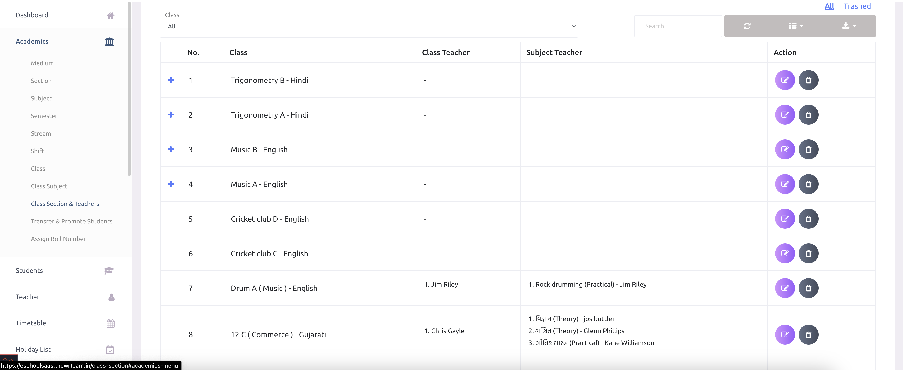

# Class Section and Teachers

English

School admins can assign class teachers or class subject teachers to any class. One class can have multiple class teachers, and one class-subject can have multiple teachers. 

हिन्दी

स्कूल एडमिन किसी भी कक्षा के लिए क्लास टीचर्स या क्लास सब्जेक्ट टीचर्स असाइन कर सकते हैं। एक कक्षा में एक से अधिक क्लास टीचर्स हो सकते हैं, और एक कक्षा-विषय (क्लास-सब्जेक्ट) के लिए भी एक से अधिक शिक्षक असाइन किए जा सकते हैं।