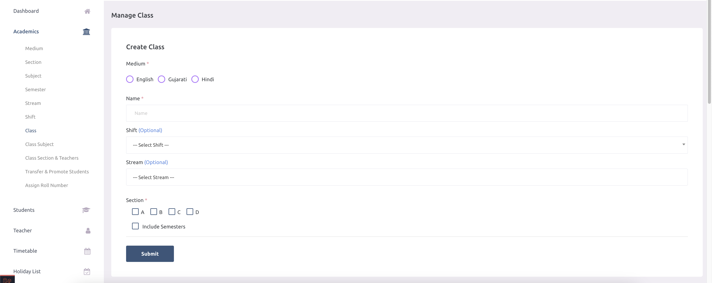
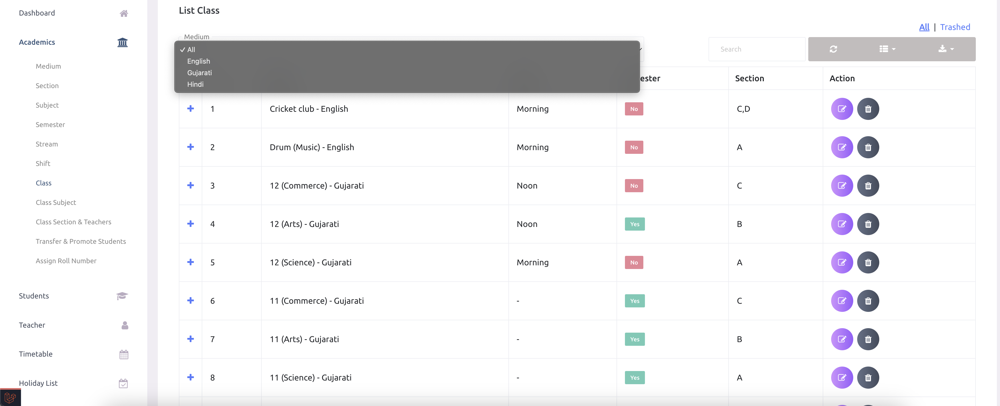
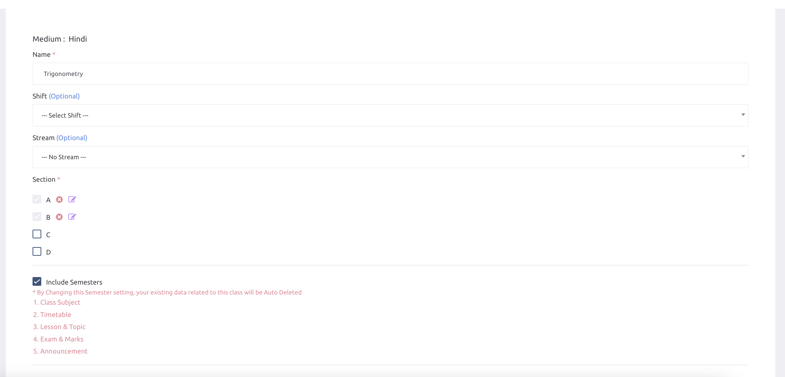

# Class

## Edit Class

English

If school admins delete a class, its subdivision, semester, subjects, and other related data will also be deleted. 

हिन्दी

यदि स्कूल एडमिन किसी कक्षा (क्लास) को डिलीट करते हैं, तो उससे जुड़ी सभी उप-वर्ग (सबडिवीजन), सेमेस्टर, विषय (सब्जेक्ट्स) और अन्य संबंधित डेटा भी हटा दिया जाएगा।