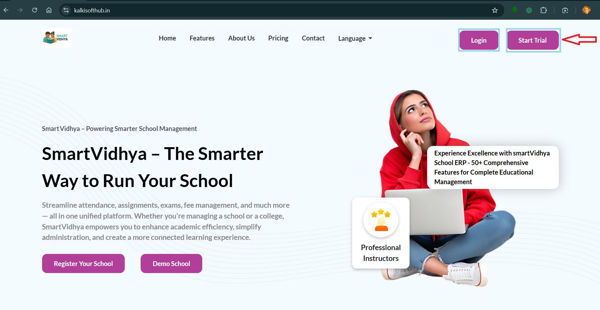
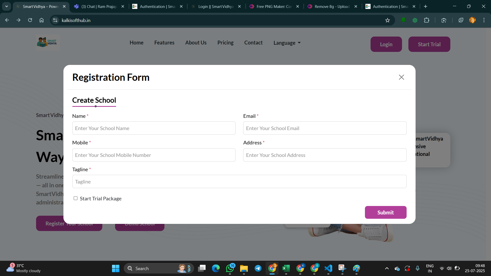
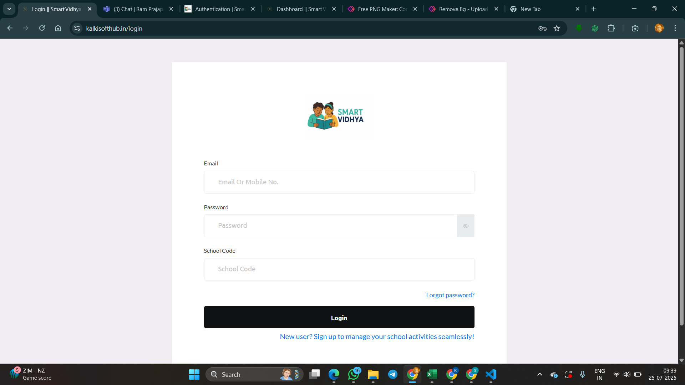

# Authentication

English

School admins can access the system using admin email and admin contact as password. After successful login, school admins can access the default features even if they don't have any active subscription. Default features are Student management, Academics management, Teacher management, and Session year management. 

हिन्दी

स्कूल एडमिन सिस्टम को एडमिन ईमेल और एडमिन कॉन्टैक्ट (संपर्क नंबर) को पासवर्ड के रूप में उपयोग करके एक्सेस कर सकते हैं। सफल लॉगिन के बाद, अगर कोई सक्रिय सब्सक्रिप्शन नहीं है तब भी स्कूल एडमिन डिफ़ॉल्ट फीचर्स का उपयोग कर सकते हैं।

डिफ़ॉल्ट फीचर्स में शामिल हैं:

छात्र प्रबंधन

शैक्षणिक प्रबंधन

शिक्षक प्रबंधन

सत्र वर्ष प्रबंधन