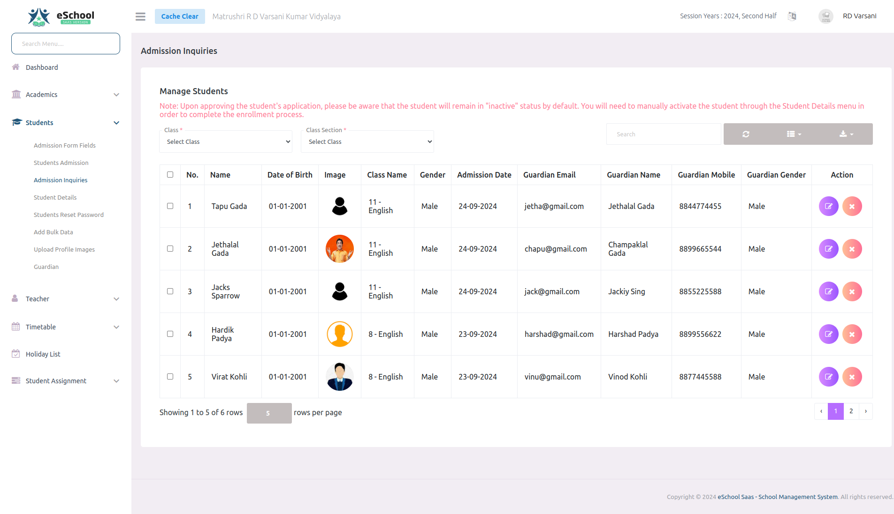

# Admission Inquiries

The online student inquiries section displays a list of student applications, allowing admins to approve or reject each application. Admins can also send automated emails to parents notifying them of the application status. 

ऑनलाइन छात्र पूछताछ अनुभाग में छात्रों के आवेदन की सूची दिखाई देती है, जिससे एडमिन प्रत्येक आवेदन को स्वीकृत (Approve) या अस्वीकृत (Reject) कर सकते हैं। एडमिन माता-पिता को आवेदन की स्थिति की सूचना देने के लिए स्वचालित ईमेल (Automated Emails) भी भेज सकते हैं।