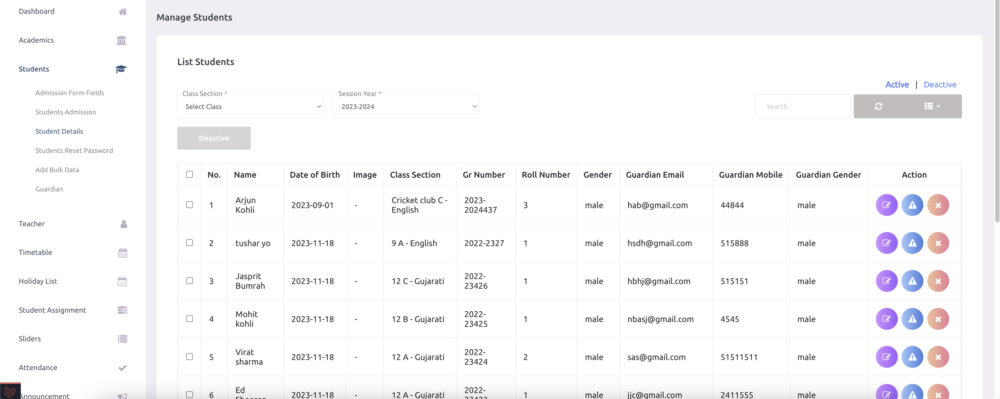

# Student Details

- School admins can view all students by class-section and session year.

- School admins can only activate students if the school has an active package. Once a student is activated, they will be added to the bill.

- School admins can update or delete students. If a school admin deletes a student, they will be removed permanently. 

स्कूल एडमिन कक्षा-सेक्शन और सत्र वर्ष के अनुसार सभी छात्रों को देख सकते हैं।

स्कूल एडमिन केवल तभी छात्रों को सक्रिय (Activate) कर सकते हैं जब स्कूल का पैकेज सक्रिय हो। एक बार छात्र को सक्रिय कर देने के बाद, उसे बिल में शामिल कर लिया जाएगा।

स्कूल एडमिन छात्रों की जानकारी को अपडेट या डिलीट कर सकते हैं। यदि कोई छात्र डिलीट किया जाता है, तो उसे स्थायी रूप से हटा दिया जाएगा।