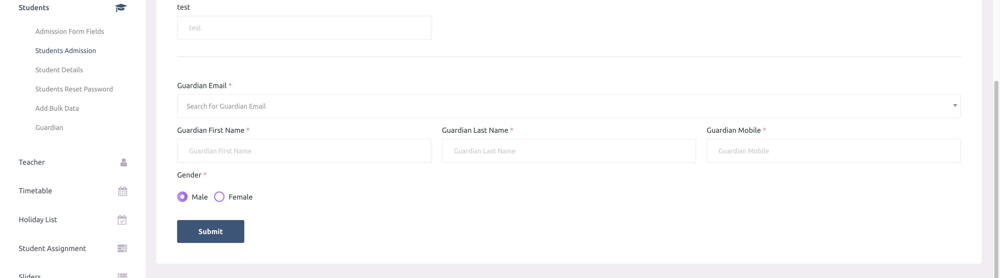

# Students Admission

- If a school has any active package at the time of adding a student, the school admin can change the status of the student (active or de-active). If the school doesn't have a package, the status of the student will be considered as de-active by default.

- At the time of adding a new student, school admins can search for guardians by email and assign them to the newly added student. If there is no guardian with the searched email, the school admin can create a new guardian along with the student. 

यदि किसी स्कूल के पास छात्र को जोड़ते समय कोई सक्रिय पैकेज मौजूद है, तो स्कूल एडमिन छात्र की स्थिति (सक्रिय या निष्क्रिय) बदल सकते हैं। यदि स्कूल के पास कोई पैकेज नहीं है, तो छात्र की स्थिति डिफ़ॉल्ट रूप से निष्क्रिय (De-active) मानी जाएगी।

नए छात्र को जोड़ते समय, स्कूल एडमिन ईमेल के माध्यम से अभिभावकों को खोज सकते हैं और उन्हें नए छात्र के साथ असाइन कर सकते हैं। यदि खोजे गए ईमेल से कोई अभिभावक मौजूद नहीं है, तो स्कूल एडमिन छात्र के साथ नया अभिभावक भी बना सकते हैं।