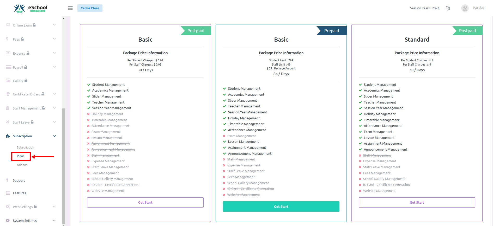

# Subscription

English

- If a school does not have any active package, they can buy a package from subscription->plans as shown in the image.

- School admins can buy a trial package if enabled by the super admin. Trial packages can only be purchased once. If a school has bought any other package, they cannot buy a trial package.

- Once a package is subscribed, it cannot be canceled. The school's upcoming package will be the same as the current package by default.

- School admins can update the current package. If a school admin updates the current package, the new package will start immediately. School admins can cancel or update the upcoming plan as well.

- School admins will have allowed days set by the super admin to pay previous bills. If a school admin fails to pay the bills within the given time, the school will be deactivated and any active package will be canceled as well.

- School admins can buy add-ons if needed. Once an add-on is added in the current cycle, it cannot be canceled. Add-ons will expire with the subscribed package. 

हिन्दी

यदि किसी स्कूल के पास कोई सक्रिय पैकेज नहीं है, तो वे Subscription -> Plans सेक्शन में जाकर नया पैकेज खरीद सकते हैं (जैसा कि चित्र में दिखाया गया है)।

यदि सुपर एडमिन द्वारा ट्रायल पैकेज सक्षम किया गया है, तो स्कूल एडमिन ट्रायल पैकेज खरीद सकते हैं।

🔸 ट्रायल पैकेज केवल एक बार ही खरीदा जा सकता है।

🔸 यदि किसी स्कूल ने पहले से कोई अन्य पैकेज खरीद लिया है, तो वे ट्रायल पैकेज नहीं खरीद सकते।

एक बार कोई पैकेज सब्सक्राइब हो जाने पर, उसे रद्द नहीं किया जा सकता।

🔸 स्कूल का आगामी पैकेज स्वतः वर्तमान पैकेज जैसा ही रहेगा।

स्कूल एडमिन अपने वर्तमान पैकेज को अपडेट कर सकते हैं।

🔸 जैसे ही नया पैकेज अपडेट किया जाएगा, वह तुरंत प्रभाव में आ जाएगा।

🔸 स्कूल एडमिन आगामी प्लान को भी रद्द या अपडेट कर सकते हैं।

स्कूल एडमिन को पिछले बिलों का भुगतान करने के लिए कुछ निश्चित दिन (allowed days) मिलेंगे, जो सुपर एडमिन द्वारा तय किए जाएंगे।

🔸 यदि निर्धारित समय में भुगतान नहीं किया गया, तो स्कूल को निष्क्रिय (deactivate) कर दिया जाएगा, और कोई भी सक्रिय पैकेज स्वतः रद्द कर दिया जाएगा।

यदि आवश्यकता हो तो स्कूल एडमिन ऐड-ऑन (Add-ons) भी खरीद सकते हैं।

🔸 एक बार कोई ऐड-ऑन चालू साइकिल में जोड़े जाने पर, उसे रद्द नहीं किया जा सकता।

🔸 ऐड-ऑन की वैधता सबसक्राइब किए गए पैकेज की समाप्ति तक ही रहेगी।