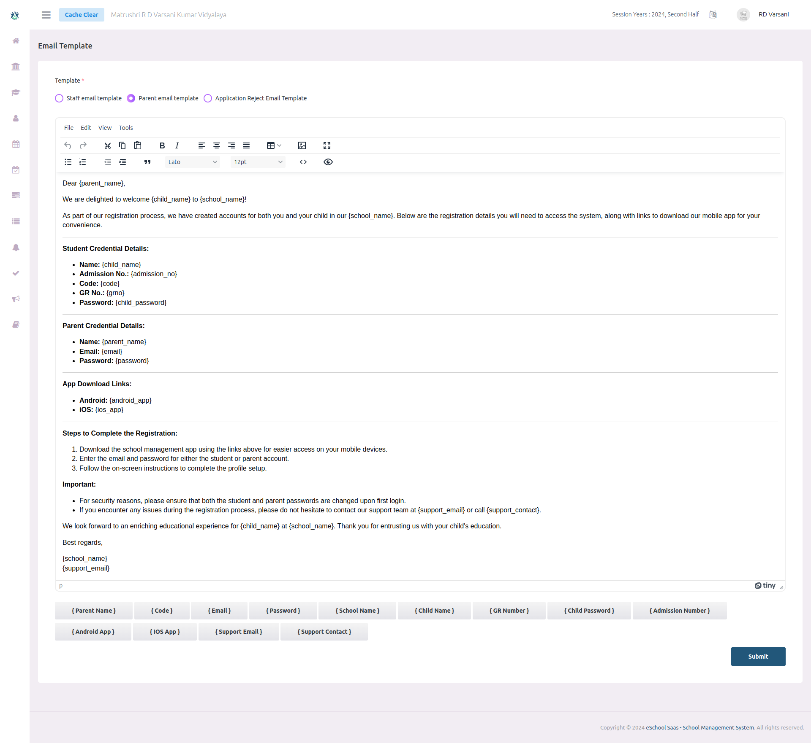

# Email Template

A school admin can create custom email templates for registering new students, staff, and teachers. This template includes credentials, key information, and any additional notes. The system will use the predefined format to send emails to new users, ensuring consistent communication and easy access to important details. 

स्कूल एडमिन नए छात्रों, स्टाफ और शिक्षकों के पंजीकरण के लिए कस्टम ईमेल टेम्पलेट बना सकते हैं। इस टेम्पलेट में लॉगिन क्रेडेंशियल्स, महत्वपूर्ण जानकारी और अतिरिक्त नोट्स शामिल होते हैं। सिस्टम इन पूर्वनिर्धारित प्रारूपों का उपयोग करके नए यूज़र्स को ईमेल भेजेगा, जिससे संचार में एकरूपता बनी रहेगी और महत्वपूर्ण जानकारियाँ आसानी से उपलब्ध होंगी।