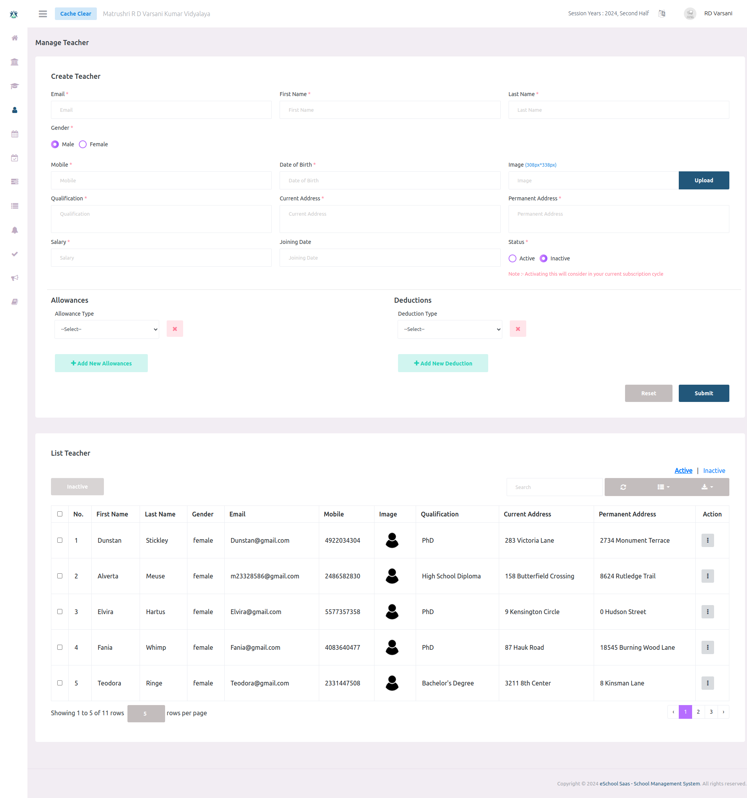

# Manage Teachers

- If a school has any active package at the time of adding a teacher, the school admin can change the status of the teacher (active or de-active). If the school doesn't have a package, the status of the teacher will be considered as de-active by default.

- School admins can only activate teachers if the school has an active package. Once a teacher is activated, they will be added to the bill.

- School admins can update or delete teachers. If a school admin deletes a teacher, they will be removed permanently. School admins need to delete other data related to teachers before deleting them.

- Teachers can login using the given email and password. The mobile number of the teacher will be the default password.

- Admins can manage teacher salaries by adding allowances or deductions, ensuring accurate payroll adjustments for each staff member. 

यदि किसी स्कूल के पास शिक्षक को जोड़ते समय कोई सक्रिय पैकेज है, तो स्कूल एडमिन शिक्षक की स्थिति (सक्रिय या निष्क्रिय) बदल सकते हैं। यदि स्कूल के पास कोई पैकेज नहीं है, तो शिक्षक की स्थिति डिफ़ॉल्ट रूप से निष्क्रिय (De-active) मानी जाएगी।

स्कूल एडमिन केवल तभी शिक्षकों को सक्रिय (Activate) कर सकते हैं जब स्कूल का पैकेज सक्रिय हो। एक बार शिक्षक को सक्रिय कर देने के बाद, उन्हें बिल में जोड़ लिया जाएगा।

स्कूल एडमिन शिक्षकों की जानकारी को अपडेट या डिलीट कर सकते हैं। यदि कोई शिक्षक डिलीट किया जाता है, तो उन्हें स्थायी रूप से हटा दिया जाएगा। शिक्षक को हटाने से पहले, उनसे संबंधित अन्य डेटा को हटाना आवश्यक है।

शिक्षक दिए गए ईमेल और पासवर्ड का उपयोग करके लॉगिन कर सकते हैं। शिक्षक का मोबाइल नंबर डिफ़ॉल्ट पासवर्ड होगा।

एडमिन वेतन में भत्ते (Allowances) या कटौतियाँ (Deductions) जोड़कर शिक्षकों के वेतन का प्रबंधन कर सकते हैं, जिससे प्रत्येक स्टाफ सदस्य के लिए सटीक वेतन समायोजन सुनिश्चित किया जा सके।